# Execution Plan

## Detailed Analysis Summary

### Change Impact Assessment
- **User-facing changes**: Yes - 고객 주문 UI + 관리자 대시보드 전체 신규 개발
- **Structural changes**: Yes - 전체 시스템 아키텍처 신규 설계 (Node.js + Vue.js + PostgreSQL)
- **Data model changes**: Yes - 매장, 테이블, 메뉴, 주문, 세션 등 전체 DB 스키마 신규
- **API changes**: Yes - REST API + SSE 전체 신규 설계
- **NFR impact**: Yes - 보안(JWT, bcrypt), 성능(SSE 2초), 확장성(멀티 테넌트 100+ 매장)

### Risk Assessment
- **Risk Level**: Medium (Greenfield이므로 기존 시스템 영향 없으나, 복잡한 실시간 통신 및 멀티 테넌트 설계 필요)
- **Rollback Complexity**: Easy (신규 프로젝트)
- **Testing Complexity**: Complex (실시간 SSE, 세션 관리, 멀티 테넌트 격리 테스트 필요)

## Workflow Visualization

```mermaid
flowchart TD
    Start(["User Request"])
    
    subgraph INCEPTION["🔵 INCEPTION PHASE"]
        WD["Workspace Detection<br/><b>COMPLETED</b>"]
        RA["Requirements Analysis<br/><b>COMPLETED</b>"]
        US["User Stories<br/><b>COMPLETED</b>"]
        WP["Workflow Planning<br/><b>IN PROGRESS</b>"]
        AD["Application Design<br/><b>EXECUTE</b>"]
        UG["Units Generation<br/><b>EXECUTE</b>"]
    end
    
    subgraph CONSTRUCTION["🟢 CONSTRUCTION PHASE"]
        FD["Functional Design<br/><b>EXECUTE</b>"]
        NFRA["NFR Requirements<br/><b>EXECUTE</b>"]
        NFRD["NFR Design<br/><b>EXECUTE</b>"]
        ID["Infrastructure Design<br/><b>EXECUTE</b>"]
        CG["Code Generation<br/><b>EXECUTE</b>"]
        BT["Build and Test<br/><b>EXECUTE</b>"]
    end
    
    Start --> WD --> RA --> US --> WP --> AD --> UG --> FD --> NFRA --> NFRD --> ID --> CG --> BT --> End(["Complete"])

    style WD fill:#4CAF50,stroke:#1B5E20,stroke-width:3px,color:#fff
    style RA fill:#4CAF50,stroke:#1B5E20,stroke-width:3px,color:#fff
    style US fill:#4CAF50,stroke:#1B5E20,stroke-width:3px,color:#fff
    style WP fill:#FFA726,stroke:#E65100,stroke-width:3px,stroke-dasharray: 5 5,color:#000
    style AD fill:#FFA726,stroke:#E65100,stroke-width:3px,stroke-dasharray: 5 5,color:#000
    style UG fill:#FFA726,stroke:#E65100,stroke-width:3px,stroke-dasharray: 5 5,color:#000
    style FD fill:#FFA726,stroke:#E65100,stroke-width:3px,stroke-dasharray: 5 5,color:#000
    style NFRA fill:#FFA726,stroke:#E65100,stroke-width:3px,stroke-dasharray: 5 5,color:#000
    style NFRD fill:#FFA726,stroke:#E65100,stroke-width:3px,stroke-dasharray: 5 5,color:#000
    style ID fill:#FFA726,stroke:#E65100,stroke-width:3px,stroke-dasharray: 5 5,color:#000
    style CG fill:#FFA726,stroke:#E65100,stroke-width:3px,stroke-dasharray: 5 5,color:#000
    style BT fill:#FFA726,stroke:#E65100,stroke-width:3px,stroke-dasharray: 5 5,color:#000
    style Start fill:#CE93D8,stroke:#6A1B9A,stroke-width:3px,color:#000
    style End fill:#CE93D8,stroke:#6A1B9A,stroke-width:3px,color:#000
    
    linkStyle default stroke:#333,stroke-width:2px
```

## Phases to Execute

### 🔵 INCEPTION PHASE
- [x] Workspace Detection (COMPLETED)
- [x] Requirements Analysis (COMPLETED)
- [x] User Stories (COMPLETED)
- [x] Workflow Planning (IN PROGRESS)
- [ ] Application Design - EXECUTE
  - **Rationale**: 전체 시스템 컴포넌트 구조, 서비스 레이어, API 설계가 필요한 신규 프로젝트
- [ ] Units Generation - EXECUTE
  - **Rationale**: DB 스키마, API 엔드포인트, 컴포넌트 인터페이스 등 상세 설계 단위 필요

### 🟢 CONSTRUCTION PHASE
- [ ] Functional Design - EXECUTE
  - **Rationale**: 각 기능의 상세 로직, 시퀀스 다이어그램, 컴포넌트 상호작용 정의 필요
- [ ] NFR Requirements - EXECUTE
  - **Rationale**: 보안(JWT, bcrypt, 로그인 제한), 성능(SSE 2초), 확장성(멀티 테넌트) 상세 요구사항 정의
- [ ] NFR Design - EXECUTE
  - **Rationale**: NFR 요구사항의 구체적 구현 설계 (인증 미들웨어, rate limiting, 테넌트 격리 전략)
- [ ] Infrastructure Design - EXECUTE
  - **Rationale**: Docker Compose 구성, PostgreSQL 설정, 네트워크 구성 설계 필요
- [ ] Code Generation - EXECUTE
  - **Rationale**: 전체 애플리케이션 코드 구현
- [ ] Build and Test - EXECUTE
  - **Rationale**: 빌드, 실행, 검증

### 🟡 OPERATIONS PHASE
- [ ] Operations - PLACEHOLDER
  - **Rationale**: 향후 배포 및 모니터링 워크플로우

## Success Criteria
- **Primary Goal**: 테이블오더 SaaS 플랫폼 MVP 구현
- **Key Deliverables**: Docker Compose로 실행 가능한 풀스택 애플리케이션
- **Quality Gates**: 고객 주문 플로우 동작, 관리자 실시간 모니터링 동작, 보안 기준 충족
